# LUCID AUDIT LOGS INGESTOR:

## Helper script to pull audit events from Lucid and send them to a permanent data store. This uses the Lucid Public API to pull audit events, and then one or more connectors to store the events. Currently provided are Splunk and a local file. More may be added later.

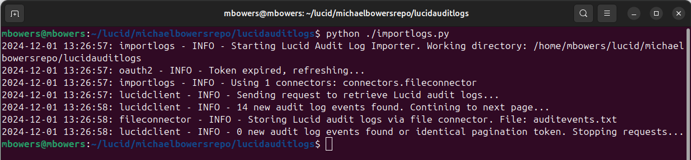

Run the tool manually to generate an OAuth2 token, which is then automatically refreshed to maintain continuous authentication. Once the token is generated, the tool can be scheduled as a cron job on Linux or a scheduled task on Windows. It continuously retrieves audit events from Lucid and forwards them to one or more configured connectors. This setup ensures secure and reliable storage of audit events from Lucid for long-term use.

# Setup.

Follow the directions below to setup the script. There are images below

1. Put the script files on the machine that will run the job to periodically pull and publish the events.
   - This guide uses `~/lucid/michaelbowersrepo/lucidauditlogs`
2. [Skip this step if you already have an oauth2 client setup]
   - Go to the [Lucid Developer Portal](https://lucid.app/developer)
   - Click `Create Application` and give it a name
   - Select the `OAuth 2.0` tab
   - Give the OAuth client a name and click `Create OAuth 2.0 client`
   - Select `Add Redirect URI` and give it the following value
     - `https://lucid.app/oauth2/clients/[CLIENT_ID]/redirect`
     - Replace the `CLIENT_ID` in that URL with the client ID of your OAuth2 client.
3. Open the `config.ini` file and set the following required values:
   - OAuth2:
     - `CLIENT_ID`: The client ID created during step 2
     - `CLIENT_SECRET`: The client secret created during step 2
   - Note: There are other values you can change, but the defaults should be sufficent for most users.
4. [Optional for Splunk Users] Populate the Splunk Connector section:
   - The script utilize the `splunk-sdk` python library available through pip or the package manager of your choice:
     - To insall the libary, run: `pip install splunk-sdk`. If your environment requires a different package manager, splunk-sdk should be available there as well.
   - FILE_CONNECTOR
     - Comment out this header unless you want events logged both locally and in splunk
   - SPLUNK_CONNECTOR
     - Uncomment out the header
     - HOST: Host value provided by Splunk. Generally, can be copied from the URL when in SplunkCloud
     - PORT: Port for API requests. Generally 8089 unless changed by an admin
     - INDEX: Which Splunk index to add the events to. Defaults to "main" which exists for most accounts
     - TOKEN: The bearer token to use for authentication requests.
       - Splunk tokens can be via Settings -> Tokens.
       - See https://docs.splunk.com/Documentation/Splunk/9.3.2/Security/CreateAuthTokens -> Use Splunk Web to create authentication tokens
   - [Optional] If you prefer to use username/password authentication instead of tokens
     - Comment out TOKEN
     - USERNAME: The username of the user to make the splunk API requests
     - PASSWORD: Password of the user to make the splunk API requests
5. Run the `importlogs` script manually via python
   - Example: `python ./importlogs.py`
   - If configured properly, the script will ask you for a `code`. Get the code by clicking the provided link to the redirect URI, granting access, and copying the code.
   - Enter the code and hit enter
   - You should see the script successfully connect, pull audit events, and send them to your configured connector(s)
   - `Common Errors`:
     - Clicking the link for the code displays `Not an Administrator`
       - You do not have adminstrative permissions to grant an account token for `audit logs`. Talk to your account owner or admin to determine how to proceed.
     - Clicking the link for the code displays `Not Found`
       - The `CLIENT_ID` in the `config.ini` file is incorrect. Double check the values from step 2.
       - If the OAuth2 client was provided to you, double check if you are a collaborator on the Application that OAuth2 client belongs to.
     - The code is generated, but I get an error message with a `401 Client Error: Unauthorized` when I enter it.
       - The `CLIENT_SECRET` in the `config.ini` file is incorrect. Double check the values from step 2.
       - The generated `code` is only valid for two minutes. Ensure you copy and paste it within that time.
6. [Optional: Windows] Setup the job to periodically run automatically
   - Go to the Search bar, look for `Scheduled Tasks` and select it
   - Select `Create Task`
     - Add a `Name` for the task
   - Select the `Actions` tab and add a new action
     - For `Action` , select `Start a program`
     - For `Program/script`, browse to the folder where you put the script and select the file `scheduled_task.bat`
     - For `Start in`, enter the file path to the folder where you put the script
     - Hit `OK` to add the action
   - Select the `On a schedule` tab
     - Select Repeat task every and choose a time frame between 5 - 30 minutes for a duration of Indefinitely
     - Hit `OK` to add the trigger
   - Hit `OK` to create the task
7. [Optional: Linux/Mac]
   - In a terminal, go to the folder where you put the script
   - Enable a cronjob to run the script by entering `chmod +x ./importlogs.py`. You may need to run with sudo
   - Open `crontab -e`
   - Scroll down to a new line
   - Create a new entry to run your job periodically like below:
     - `when to run` `folder to execute in` `file to execute`
       - Example: `*/10 * * * *   cd /home/mbowers/lucid/michaelbowersrepo/ lucidauditlogs ; ./importlogs.py`
     - The first section defines when to run. `*_/10 _ * * *` means every 10 minutes
     - The second section tells the job what folder to execute the files in
     - The third section is the file to execute.
   - Close crontab. (If using nano, Ctrl+O Enter, then Ctrl+X)
   - After the script runs, check the log to ensure the script is running properly.

### Configuring the OAuth2 Redirect

| A properly configured redirect uri |
| :--------------------------------: |
|    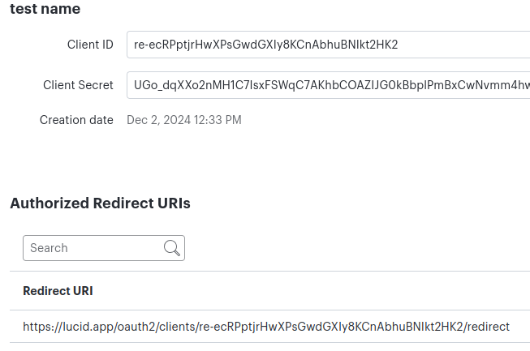     |

### Generating the first token

|  Request token on first run  |
| :--------------------------: |
| 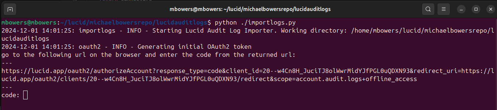 |

| Grant access to audit logs  |
| :-------------------------: |
| 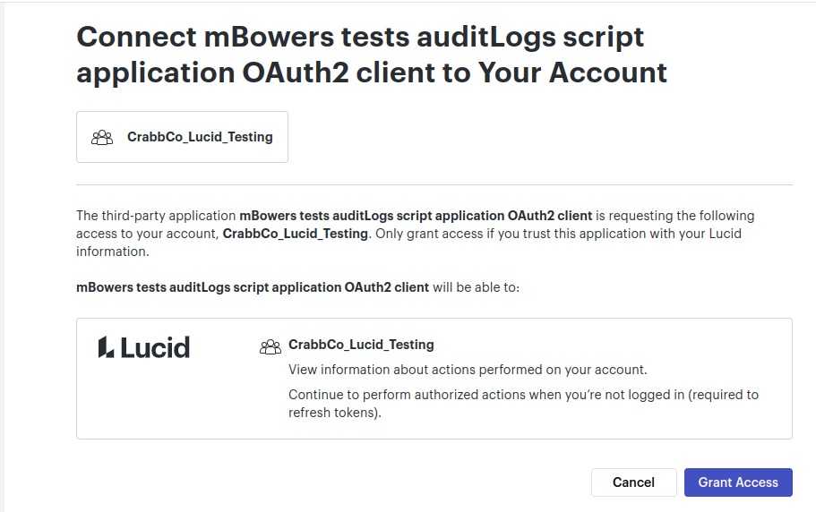 |

| Copy Authentication Code |
| :----------------------: |
| 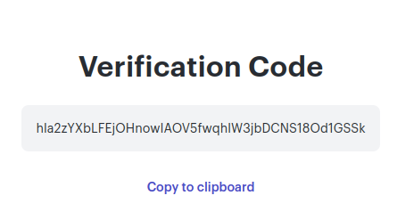 |

| Paste Authentication Code |
| :-----------------------: |
| 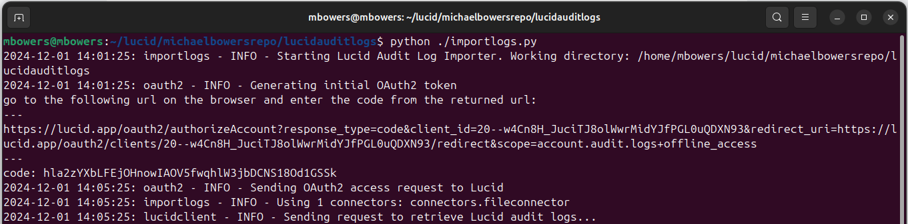 |

### Creating a scheduled task in Windows

|    Task Scheduler Window     |
| :--------------------------: |
| 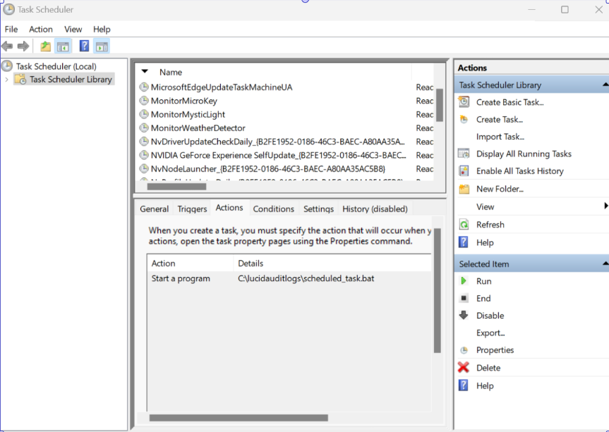 |

|        Edit Action         |
| :------------------------: |
| 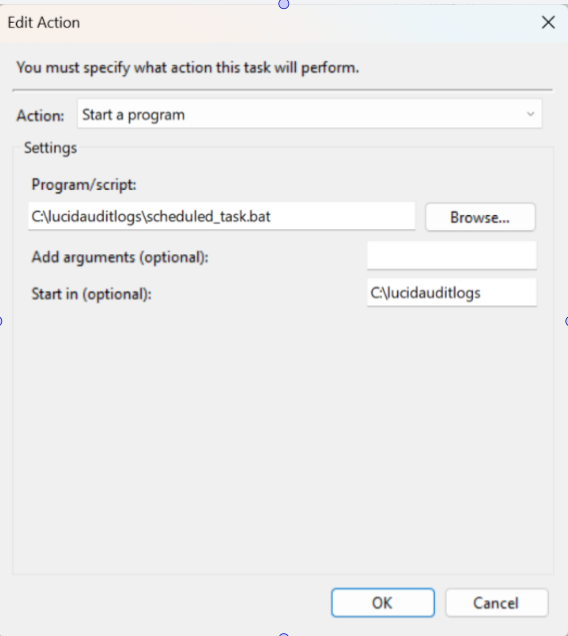 |

|       Setup Trigger        |
| :------------------------: |
| 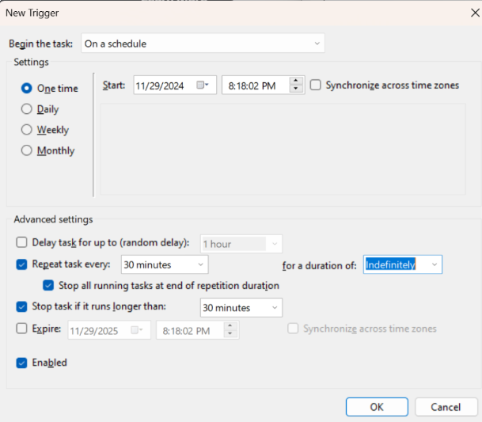 |

|        Successful Run         |
| :---------------------------: |
| 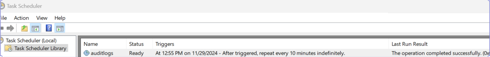 |

### Creating a cronjob on Linux/Mac

|     Creating the cronjob      |
| :---------------------------: |
| 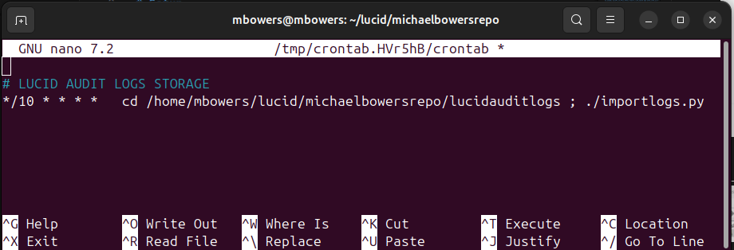 |
